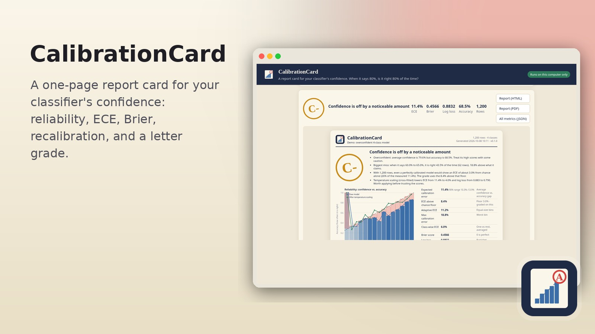

# CalibrationCard



When your classifier says **80%**, is it right 80% of the time? CalibrationCard takes any model's predictions CSV
and gives you a one-page **report card**: reliability diagram, ECE / MCE / adaptive ECE / class-wise ECE, Brier
score, log loss, a confidence histogram, per-class calibration, and cross-fitted temperature, Platt and isotonic
recalibration with before/after numbers. It ends with a letter grade and plain-English notes.

It is a companion to [SplitCheck](https://github.com/grummpy/SplitCheck) and
[LabelNoiseAudit](https://github.com/grummpy/LabelNoiseAudit): those check your data and splits, this checks
whether the probabilities your model outputs can be trusted.

## Quick start

1. Download or clone this repo (`git clone https://github.com/grummpy/CalibrationCard`).
2. Double-click the launcher for your computer:
   - **Mac:** `Launch CalibrationCard.command` (first time: right-click → Open if macOS warns about an unidentified developer)
   - **Windows:** `Launch CalibrationCard.bat`
   - **Linux:** `launch.sh` (or install `calibrationcard.desktop`)
3. The first run creates a private `.venv` and installs pinned packages (a minute or two). Later runs start quickly.
4. Your browser opens at `http://127.0.0.1:8742/`. Drop in a CSV, or press **Try the demo**.
5. Check the detected columns, press **Grade it**, then download the report as HTML, PDF or JSON.

You need Python 3.11 or newer. If it is missing, the launcher says so and links to https://www.python.org/downloads/.

## Input format

One row per example. One true-label column, plus either:

- **one probability column per class**: `label, p_cat, p_dog, p_fox` (also accepted: `prob_cat`, `proba_cat`,
  `cat_prob`, or columns named exactly like the classes), or
- **one score column for a binary model**: `y_true, score` (the score is P(positive)). Pick the positive class
  in the app or with `--positive`.

Rows with a missing value are skipped and counted. Rows that do not add up to 1 are rescaled (rounding noise is
rescaled silently; bigger errors are reported because they usually mean a missing column).

## What the grade means

The letter comes from the **expected calibration error above the chance floor**. Even a perfectly calibrated
model shows some ECE on a finite test set just from sampling noise, so CalibrationCard simulates that floor for
your exact confidences and grades only what is left over. Small test sets are not punished for being small.

| Grade | ECE above floor |
| --- | --- |
| A | under 2% |
| B | 2 to 5% |
| C | 5 to 10% |
| D | 10 to 15% |
| F | 15% or more |
| I (Incomplete) | under 100 rows, or under 5 mistakes with no clear gap |

Overconfidence only shows up through mistakes, so a model with almost no wrong answers gets **Incomplete**
rather than an A it has not earned. The provisional letter is still shown in the notes. Each letter is split into
+ / plain / − thirds.

Recalibration is **cross-fitted** (2 folds by default): each row is scored by a calibrator that never saw it, so
the "after" numbers are honest. The recommended method is picked by log loss. It is skipped when there are fewer
than 10 mistakes, because then a calibrator can only learn to be more certain.

## Command line

```bash
.venv/bin/python -m calibrationcard grade predictions.csv --html report.html --pdf report.pdf --json metrics.json
.venv/bin/python -m calibrationcard grade scores.csv --label y_true --prob-cols score --positive 1
.venv/bin/python -m calibrationcard grade predictions.csv --bins 10 --methods temperature platt
.venv/bin/python -m calibrationcard demo demo.csv
```

PDF export uses a local Chrome, Chromium or Edge in headless mode. Without one, open the HTML report and use
**Print → Save as PDF**; it is laid out for one Letter page.

## Developer setup

```bash
python3 -m venv .venv
.venv/bin/pip install -r requirements-dev.txt
.venv/bin/pip install -e . --no-deps
.venv/bin/python -m pytest
.venv/bin/ruff check .
python scripts/render_assets.py   # redraw the icons
```

Optional packaged app: `pip install pyinstaller && python scripts/build_app.py` on the OS you want a bundle for.
Not built in CI.

## Privacy

- The web UI binds to `127.0.0.1` only. Uploaded CSVs are held in memory (the last 10); PDF reports are written to the
  local `data/` folder. Nothing is sent anywhere.
- Reports are self-contained HTML (no external fonts, scripts or images).
- This repo ships synthetic example data only.

## Validation on real model outputs

Before release, CalibrationCard was run through the CLI and the web server on real predictions from Chris's
own repos: LabelNoiseAudit's out-of-fold probabilities (iris, wine, digits, field notes), VAMailSorter's held-out
test predictions (4 models), and TSPPredictor's out-of-sample fund probabilities. See the pull request for the
numbers. That run is why the chance-floor grading, the Incomplete grade, and the "too few mistakes to recalibrate"
rule exist.

## Limitations

- The macOS `.command` and Windows `.bat` launchers have not been run on a Mac or Windows PC yet. The Linux launcher has.
- ECE depends on the number of bins (15 by default, top-label, equal width from 1/k to 1). Adaptive ECE is shown too.
- Multiclass Platt and isotonic are one-vs-rest followed by rescaling rows to sum to 1.
- The grade bands are a convention, not a standard. Read the notes and the diagram, not just the letter.
